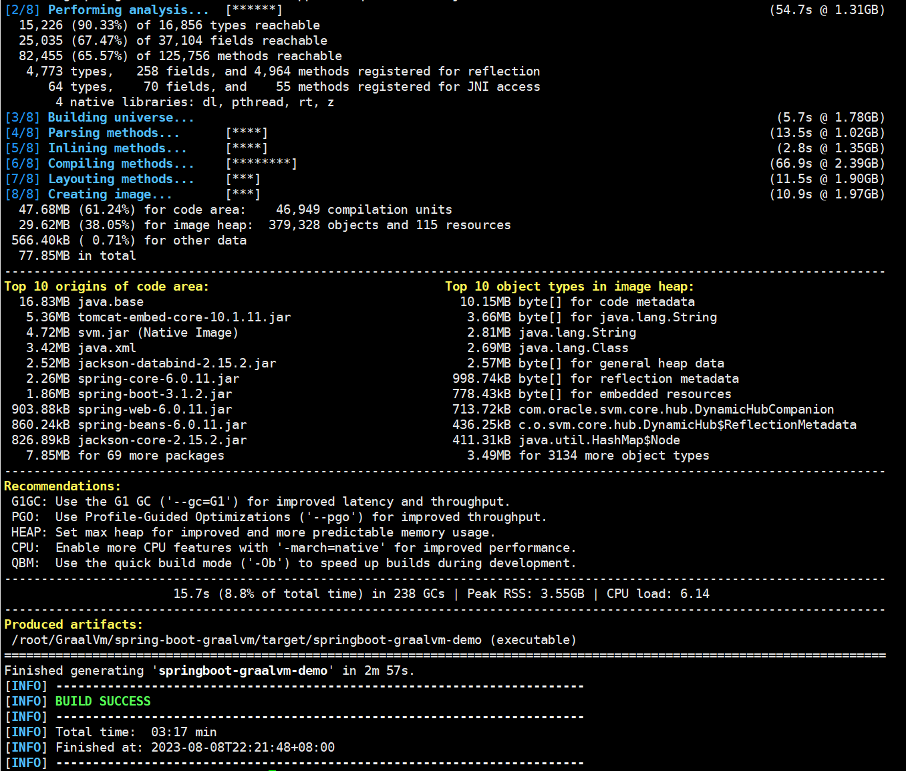
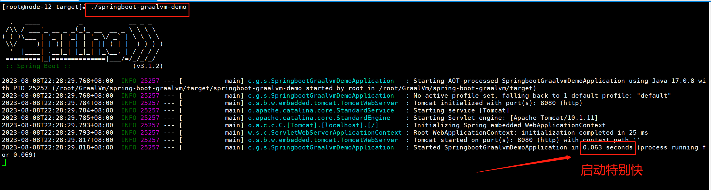

# SpringBoot GraalVM Native Image Support

## 内容预览：

- GraalVM介绍
- Ahead-of-Time（AOT技术）介绍
- SpringBoot如何使用GraalVM构建本地可执行环境
- 相同工程JVM和GraalVM启动性能对比

## 一、GraalVM Native Images优点

- 可以编译java应用程序得到操作系统本地linux可执行文件或者windows中的exe文件。
- 可以花费更少的内存、更好的性能运行SpringBoot。


## 二、GraalVM Native Images介绍

GraalVM本机镜像提供了一种部署和运行Java应用程序的新方法。与Java虚拟机相比，本机镜像可以使用`更小的内存占用`和`更快的启动时间`来运行。它们非常适合使用容器镜像部署的应用程序。与为JVM编写的传统应用程序不同，GraalVM Native Image应用程序需要提前处理才能创建可执行文件。这种提前处理涉及从应用程序的主要入口点静态分析应用程序代码。GraalVM本机镜像是一个完整的、特定于平台的可执行文件。您不需要附带Java虚拟机来运行本机镜像，意思就是当你编译得到一个可执行文件后在别的机器可以不用安装JDK也是可以运行的。

`总结`

- 可以使用`更小的内存占用`和`更快的启动时间`来运行java程序。
- 可以`不用安装`JDK来运行java程序。

## 三、GraalVM与传统JVM部署的主要区别

GraalVM本机镜像是提前生成的，这意味着本机应用程序和基于JVM的应用程序之间存在一些关键差异。

`主要区别在于:`

应用程序的静态分析是在构建时从主入口点执行的。在创建本机镜像时`无需访问的代码`将被删除，并且不会成为可执行文件的一部分（起到一个瘦身合理利用空间）。GraalVM不能直接感知代码中的动态元素，必须告诉它反射、资源、序列化和动态代理。应用程序类路径在构建时是固定的，不能更改。没有延迟类加载，可执行文件中的所有内容将在启动时加载到内存中。Java应用程序的某些方面存在一些限制，这些方面没有得到完全支持。

`总结`

- 编译之后删除`无需访问`的代码。
- `没有延迟类加载`可执行文件中的所有内容将在启动时加载到内存中。

## 四、理解SpringBoot Ahead-of-Time（AOT）处理

典型的Spring Boot应用程序是动态的，配置是在运行时执行的。事实上，Spring Boot自动配置的概念在很大程度上依赖于对运行时状态的反应，以便正确配置。虽然可以告诉GraalVM应用程序的这些动态方面，但这样做会抵消静态分析的大部分好处。因此，当使用Spring Boot创建本机镜像时，假设是一个封闭的世界，并且应用程序的动态方面受到如下限制：

- 例如：Spring @Profile注释和特定于概要文件的配置有局限性。

- 例如：不支持在创建bean时更改属性。

当这些出现以上或者类似限制时，Spring就有可能在构建时执行提前处理，并生成GraalVM可以使用的相关文件。`Spring AOT`处理的应用程序通常会生成:

- Java source code

- Bytecode(用于动态代理等)

- GraalVM JSON提示文件：

  > - Resource hints (`resource-config.json`)
  > - Reflection hints (`reflect-config.json`)
  > - Serialization hints (`serialization-config.json`)
  > - Java Proxy Hints (`proxy-config.json`)
  > - JNI Hints (`jni-config.json`)

### 1、Source Code Generation

`java源代码`

编译前会把动态调用转换成静态调用，从而提升性能。（如何理解：见下文）

`动态代码`

例如我们使用一个常用的@Configuration类:

```java
@Configuration
public class MyConfiguration {

    @Bean
    public MyBean myBean() {
        return new MyBean();
    }

}
```

以上这段代码对于SpringBoot加载原理可以简单理解为：

Spring通过解析@Configuration注解并查找@Bean方法来创建bean定义。在上面的示例中，我们为名为myBean的单例bean定义了一个BeanDefinition。我们还为MyConfiguration类本身创建了一个BeanDefinition。当需要myBean实例时，Spring知道它必须调用myBean()方法并使用结果。当在JVM上运行时，@Configuration类解析在应用程序启动时发生，并且使用反射调用@Bean方法。在创建本机镜像时，Spring以不同的方式操作。它不是在运行时解析@Configuration类并生成bean定义，而是在构建时进行。一旦发现了bean定义，它们就会被处理并转换为GraalVM编译器可以分析的源代码。

`AOT等价转换静态代码`

```java
/**
 * Bean definitions for {@link MyConfiguration}.
 */
public class MyConfiguration__BeanDefinitions {

    /**
     * Get the bean definition for 'myConfiguration'.
     */
    public static BeanDefinition getMyConfigurationBeanDefinition() {
        Class<?> beanType = MyConfiguration.class;
        RootBeanDefinition beanDefinition = new RootBeanDefinition(beanType);
        beanDefinition.setInstanceSupplier(MyConfiguration::new);
        return beanDefinition;
    }

    /**
     * Get the bean instance supplier for 'myBean'.
     */
    private static BeanInstanceSupplier<MyBean> getMyBeanInstanceSupplier() {
        return BeanInstanceSupplier.<MyBean>forFactoryMethod(MyConfiguration.class, "myBean")
            .withGenerator((registeredBean) -> registeredBean.getBeanFactory().getBean(MyConfiguration.class).myBean());
    }

    /**
     * Get the bean definition for 'myBean'.
     */
    public static BeanDefinition getMyBeanBeanDefinition() {
        Class<?> beanType = MyBean.class;
        RootBeanDefinition beanDefinition = new RootBeanDefinition(beanType);
        beanDefinition.setInstanceSupplier(getMyBeanInstanceSupplier());
        return beanDefinition;
    }

}
```

从上面转换后的代码可以看出获取Bean的方式全都转换成static静态调用的，避免的SpringBoot在运行时通过反射来调用Bean了。

`注意`

```tex
在Spring AOT处理期间，将启动应用程序，直到bean定义可用为止。在AOT处理阶段不会创建Bean实例。
```

### 2、Hint File Generation（提示文件）

`GraaVM相关提示文件`

除了生成源文件外，Spring AOT引擎还将生成GraalVM使用的提示文件。提示文件包含JSON数据，这些数据描述了GraalVM应该如何处理通过直接检查代码无法理解的事情。例如，您可能在私有方法上使用Spring注释。Spring将需要使用反射来调用私有方法，即使在GraalVM上也是如此。当出现这种情况时，Spring可以编写一个反射提示，以便GraalVM知道即使`私有方法`没有被直接调用，它仍然需要在本机镜像中可用。提示文件是在META-INF/native-image下生成的，GraalVM会自动拾取它们。

`提示`

```tex
当使用Maven时，生成的提示文件可以在target/spring-aot/main/resources中找到，而使用Gradle时可以在build/ Generated /aotResources中找到。
```

### 3、Proxy Class Generation

`动态代理`

Spring有时需要生成代理类，以便用附加特性增强您编写的代码。为此，它使用了`直接生成字节码的cglib库`。

当应用程序在JVM上运行时，代理类会在应用程序运行时动态生成。在创建本机镜像时，需要在构建时创建这些代理，以便GraalVM可以包含它们。

`提示`

```tex
与源代码生成不同，生成的字节码在调试应用程序时并不是特别有用。但是，如果您需要使用javap等工具检查.class文件的内容，您可以在Maven的target/spring-aot/main/classes和Gradle的build/generated/aotClasses中找到它们。
```

## 五、GraalVM Native 应用

​	现在我们已经了解了GraalVM Native Images以及Spring AOT提前引擎的工作原理，我们可以看看如何创建一个应用程序。构建Spring Boot本机镜像应用程序有`两种主要方法`:

- 使用Spring Boot对Cloud native Buildpacks的支持来生成包含本机可执行文件的轻量级容器。
- 使用GraalVM原生构建工具生成原生可执行文件。（本文演示方法）

### 1、演示环境

- **Linux Red Hat 4.8.5-44**
- **graalvm-jdk-17** [下载](https://download.oracle.com/graalvm/17/latest/graalvm-jdk-17_linux-x64_bin.tar.gz)
- **apache-maven-3.9.4** [下载](https://dlcdn.apache.org/maven/maven-3/3.9.4/binaries/apache-maven-3.9.4-bin.tar.gz)

- **SpringBoot 3.1.2**

### 2、GraalVM安装教程

[参考官网](https://docs.oracle.com/en/graalvm/jdk/17/docs/getting-started/installation-linux/#installation-on-linux-platforms)

- 下载graalvm-jdk-17_linux-x64_bin.tar.gz文件到目录

- 解压该文件

- 配置JAVA_HOME和PATH

  ```properties
  # 这个为graalvm-jdk-17_linux-x64_bin.tar.gz文件解压的目录
  export JAVA_HOME=/root/GraalVm/graalvm-jdk-17
  export PATH=$JAVA_HOME/bin:$PATH
  ```

- 验证是否安装成功

  ```shell
  [root@node-12 graalvm-jdk-17]# java -version
  java version "17.0.8" 2023-07-18 LTS
  Java(TM) SE Runtime Environment Oracle GraalVM 17.0.8+9.1 (build 17.0.8+9-LTS-jvmci-23.0-b14)
  Java HotSpot(TM) 64-Bit Server VM Oracle GraalVM 17.0.8+9.1 (build 17.0.8+9-LTS-jvmci-23.0-b14, mixed mode, sharing)
  
  ```

  以上出现GraalVM表示安装成功。

### 3、构建SpringBoot工程

[工程源码参考](https://github.com/ShouZhiDuan/spring-boot-graalvm)

### 4、工程说明

- pom引入

  ```xml
  <parent>
      <groupId>org.springframework.boot</groupId>
      <artifactId>spring-boot-starter-parent</artifactId>
      <version>3.1.2</version>
      <relativePath/>
  </parent>
  
  <plugin>
      <groupId>org.graalvm.buildtools</groupId>
      <artifactId>native-maven-plugin</artifactId>
  </plugin>
  ```

工程需要确定以上`SpringBoot`版本需要3.x版本及以上，然后需要引入`native-maven-plugin`插件，用于构建GraalVM Native Images用的。

### 5、开始构建

- 第一步：git clone git@github.com:ShouZhiDuan/spring-boot-graalvm.git
- 第二步：cd spring-boot-graalvm
- 第三步：mvn -Pnative native:compile

执行以上三步会出现：

```te
[1/8] Initializing...   (9.3s @ 0.18GB)
 Java version: 17.0.8+9-LTS, vendor version: Oracle GraalVM 17.0.8+9.1
 Graal compiler: optimization level: 2, target machine: x86-64-v3, PGO: ML-inferred
 C compiler: gcc (redhat, x86_64, 4.8.5)
 Garbage collector: Serial GC (max heap size: 80% of RAM)
 1 user-specific feature(s)
[2/8] Performing analysis...  [******] (54.7s @ 1.31GB)
  15,226 (90.33%) of 16,856 types reachable
  25,035 (67.47%) of 37,104 fields reachable
  82,455 (65.57%) of 125,756 methods reachable
   4,773 types,   258 fields, and 4,964 methods registered for reflection
      64 types,    70 fields, and    55 methods registered for JNI access
       4 native libraries: dl, pthread, rt, z
[3/8] Building universe...                                                                               (5.7s @ 1.78GB)
[4/8] Parsing methods...      [****]                                                                    (13.5s @ 1.02GB)
[5/8] Inlining methods...     [****]                                                                     (2.8s @ 1.35GB)
[6/8] Compiling methods...    [********]                                                                (66.9s @ 2.39GB)
[7/8] Layouting methods...    [***]                                                                     (11.5s @ 1.90GB)
[8/8] Creating image...       [***]                                                                     (10.9s @ 1.97GB)
  47.68MB (61.24%) for code area:    46,949 compilation units
  29.62MB (38.05%) for image heap:  379,328 objects and 115 resources
 566.40kB ( 0.71%) for other data
  77.85MB in total
------------------------------------------------------------------------------------------------------------------------
Top 10 origins of code area:                                Top 10 object types in image heap:
  16.83MB java.base                                           10.15MB byte[] for code metadata
   5.36MB tomcat-embed-core-10.1.11.jar                        3.66MB byte[] for java.lang.String
   4.72MB svm.jar (Native Image)                               2.81MB java.lang.String
   3.42MB java.xml                                             2.69MB java.lang.Class
   2.52MB jackson-databind-2.15.2.jar                          2.57MB byte[] for general heap data
   2.26MB spring-core-6.0.11.jar                             998.74kB byte[] for reflection metadata
   1.86MB spring-boot-3.1.2.jar                              778.43kB byte[] for embedded resources
 903.88kB spring-web-6.0.11.jar                              713.72kB com.oracle.svm.core.hub.DynamicHubCompanion
 860.24kB spring-beans-6.0.11.jar                            436.25kB c.o.svm.core.hub.DynamicHub$ReflectionMetadata
 826.89kB jackson-core-2.15.2.jar                            411.31kB java.util.HashMap$Node
   7.85MB for 69 more packages                                 3.49MB for 3134 more object types
------------------------------------------------------------------------------------------------------------------------
Recommendations:
 G1GC: Use the G1 GC ('--gc=G1') for improved latency and throughput.
 PGO:  Use Profile-Guided Optimizations ('--pgo') for improved throughput.
 HEAP: Set max heap for improved and more predictable memory usage.
 CPU:  Enable more CPU features with '-march=native' for improved performance.
 QBM:  Use the quick build mode ('-Ob') to speed up builds during development.
------------------------------------------------------------------------------------------------------------------------
                       15.7s (8.8% of total time) in 238 GCs | Peak RSS: 3.55GB | CPU load: 6.14
------------------------------------------------------------------------------------------------------------------------
Produced artifacts:
 /root/GraalVm/spring-boot-graalvm/target/springboot-graalvm-demo (executable)

```





如上图表示构建成功，并且在工程target目录出现可执行文件`springboot-graalvm-demo`。


### 6、执行文件

```shell
[root@node-12 target]# ./springboot-graalvm-demo 
```



`同一个工程传统的SpringBoot启动耗时如下`


### 7、性能差异

`相差26倍`


## 六、参考文献

- [SpringBoot GraalVM Native Image Support](https://docs.spring.io/spring-boot/docs/current/reference/html/native-image.html#native-image)
- [GraalVM Download](https://download.oracle.com/graalvm/17/latest/graalvm-jdk-17_linux-x64_bin.tar.gz)
- [GraalVM Online Documentation](https://docs.oracle.com/en/graalvm/jdk/17/)
- [GraalVM Installation Instructions](https://docs.oracle.com/en/graalvm/jdk/17/docs/getting-started/#getting-started-with-oracle-graalvm)

